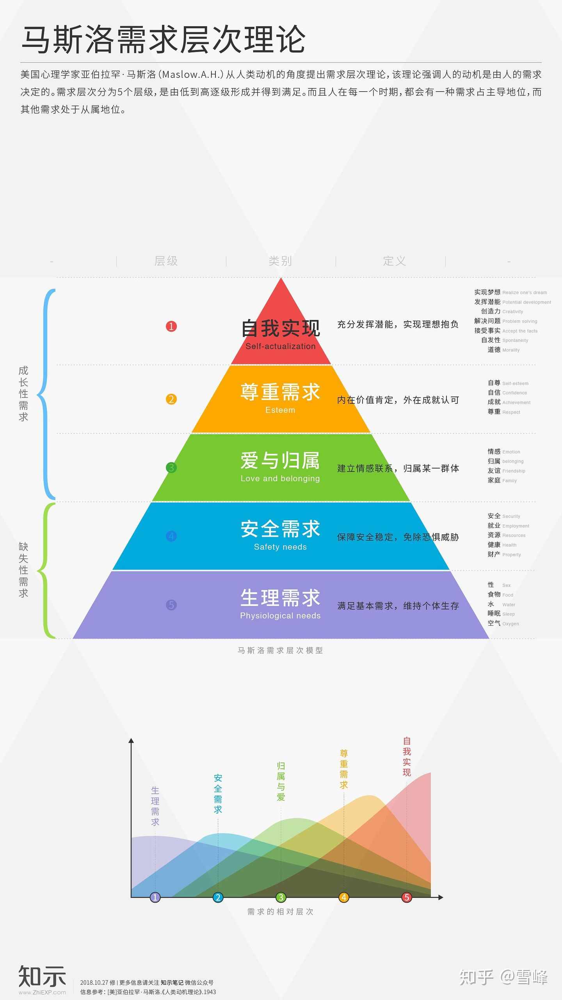
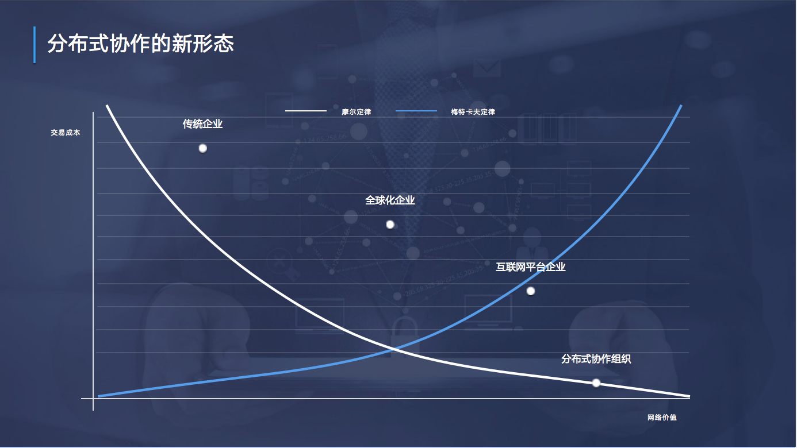
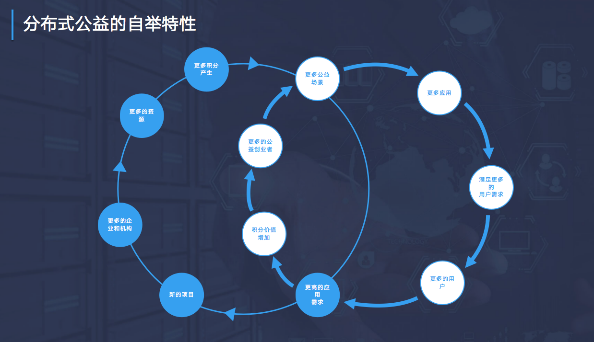
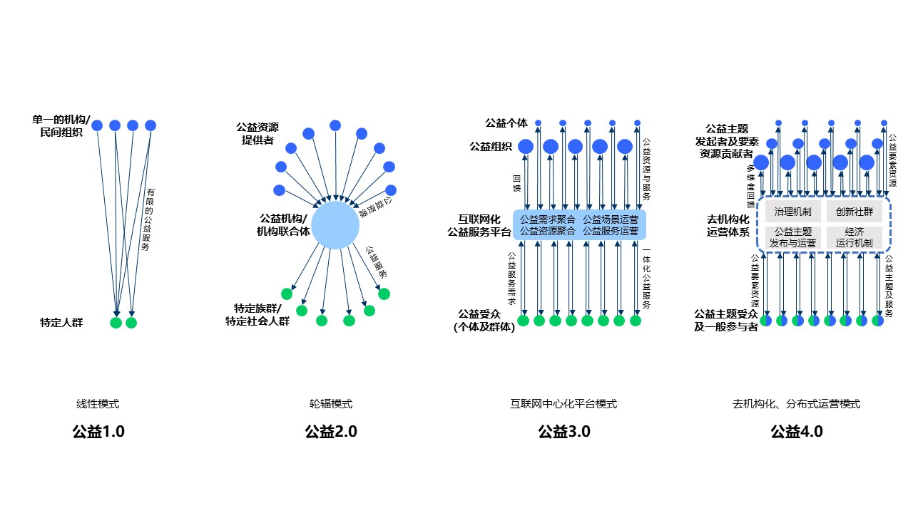
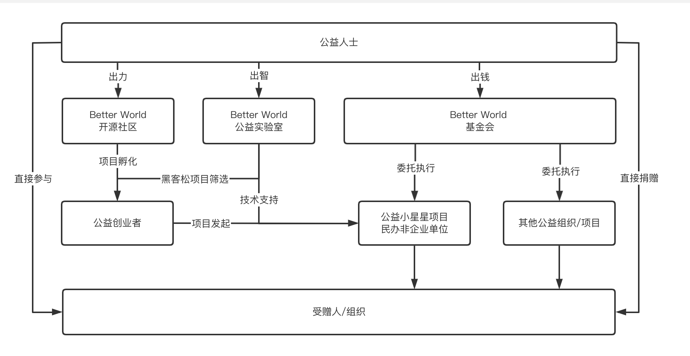
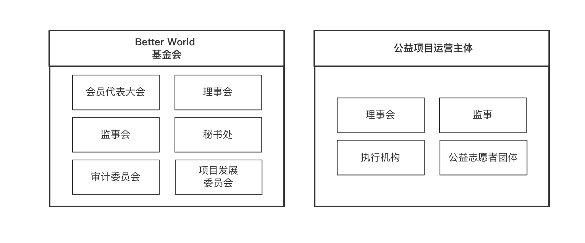
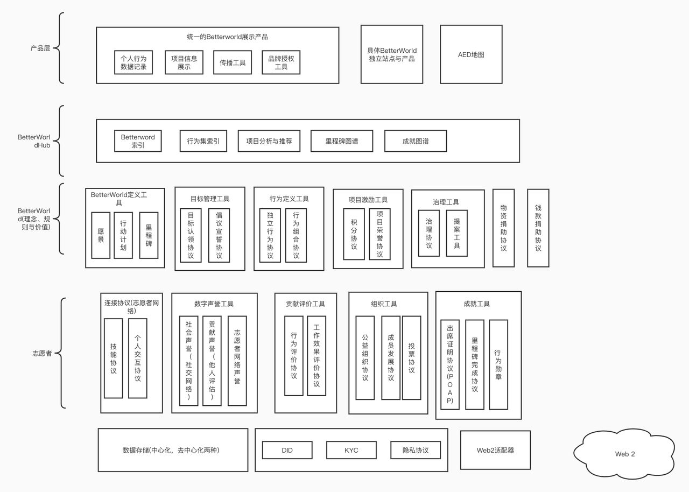
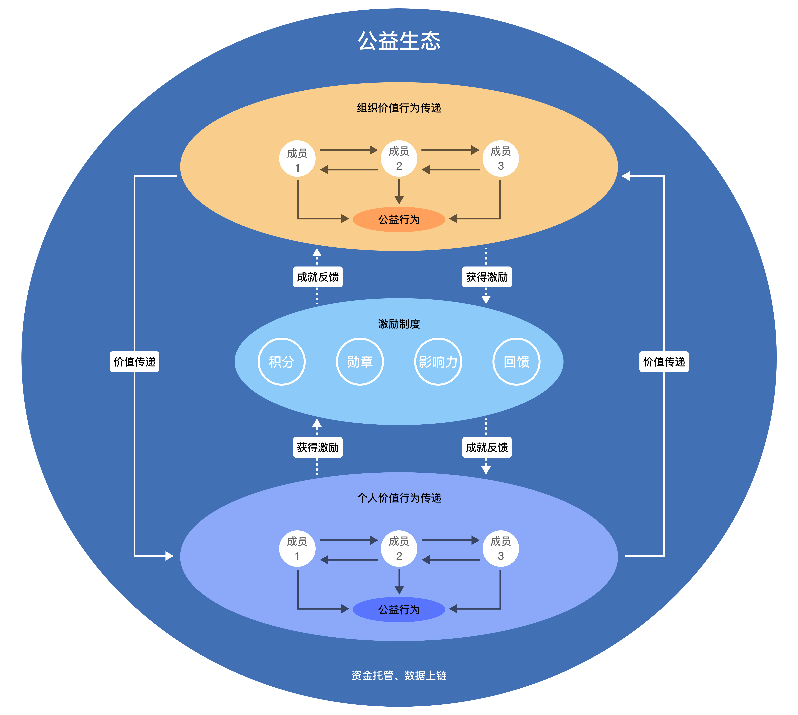
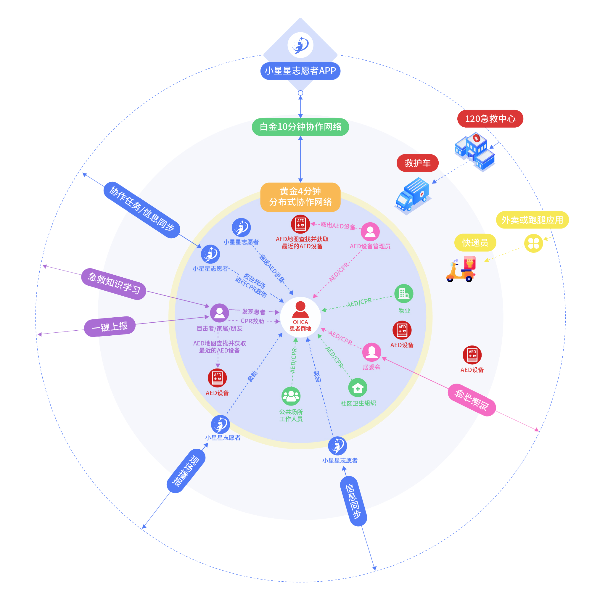
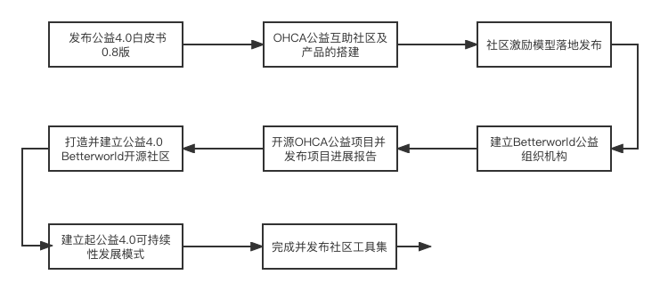

# BetterWorld 白皮书 0.1

# 目录：

什么是BetterWorld

- 概述
- 背景（现在的情况，技术发展、疫情防控等，区块链的探索）
- 分布式协作
- 公益4.0
- 出发点和原则

怎么做BetterWorld

- 创新思路：Play-to-Give（Save）游戏化、社区化、众包化、通用公益积分、区块链赋能的可信协作、公益创业机制等

- BetterWorld公益生态网络机构设置

- BetterWorld公益生态网络组织架构
- 产品工具-BetterWorld Hub
- 公益开源社区

- BetterWorld公益生态
  - 激励机制

- 协作机制

- 实现路径

- 实践案例-AED互助社区

- 团队成员

- 项目Mile Stone

# 什么是BetterWorld

## 概述

### Help you help others 帮你帮助他人，一个新潮的开源公益社区

BetterWorld 公益新世界是由区块链等互联网技术赋能个人、社会组织、企业和政府共同参与的，基于分布式协作的新一代公益社区，致力于以开源技术创新创造更有价值，更高效协作的新公益生态。

BetterWorld由泛行业公益人士，贡献各自能量，以区块链+互联网技术作为底层技术支撑，由每个参与者共同建设的一个公益性开源组织、品牌和载体。BetterWorld致力于聚集一批有公益心的人，想帮助他人的人，形成社区，并通过互联网和区块链技术，为每一个参与的个人或者组织赋能，提供开源技术工具、协作机制、基金会、理事会等支持，从而帮助社区更好的帮助他人，被帮助的人也会加入社区，扩大社区的影响力持续帮助更多的人。 BetterWorld尝试改变传统做公益的方式，从机构到个人，通过分布式协作机制，每个人都是参与者（执行者），贡献者，运营者，以及受益者，从而大大提升公益行业的效率，拓宽传统公益行业的边界。

——**立足于社区，打破传统公益行业边界，专注创造价值的互联网产品**

区别于传统的公益平台，通过互助、分布式管理、和开源共建等运营机制，专注于解决社区发起的一些社会问题或创造一个新的社会价值。

——**推动社群共同创新，挖掘公益创业者共创公益产品的互联网平台**

BetterWorld最大的价值是打破传统公益的思维，让每个参与者都成为创造者。公益领域更需要这样的实践来创造更多的优秀公益产品，进而降低创新的成本。结合数字化传播赋能社区，由用户推动产品的设计和生产。

——**通过游戏化运营和社交属性，利他即利己，举手之劳就可以做公益**

通过BetterWorld的创新机制，降低做公益的门槛，在帮助别人的同时也在帮助自己，在做公益的同时结识到更多有公益心的志同道合的朋友，并可一起进行有趣的公益创业。

——**网络公益创新跨界融合加速，开拓”公益4.0+“新型公益社区，全新的社会契约**

发挥社区用户所长可以与所有产业和行业产生化学反应，公益将升级为“公益4.0+”，通过创新融合渗透各个领域，凝聚每一份善心和有益的行为习惯，由量变产生质变。

——**链接个人、企业和政府，建立可持续发展的数字化公益社区**

BetterWorld通过数字化工具BetterWorld hub和公益开源社区，为社区提供高效率低成本的公益服务，实现用户、资金、项目、社会关系闭环。把日常工作和生活中的有益行为信息实现可统计、可标记化，形成可沉淀、可持续发展、可复用的数据，并将这些数据资产，为社区所用。在未来商业化方面，BetterWorld会采用收取低额管理费和服务费，及包括培训、公益活动、推广宣传等增值服务等收入形式，同时增加面向企业端的整体公益解决方案、员工参与计划等收入方式。基于小程序的高留存和群工具定位，还将面向基于公益大背景下的横向领域，诸如保险、助农、零售等方向扩展，并将所有的资源向社区公开、开源，实现社区的可持续发展。

​     随着物质文化生活的日益丰富，大部分城市居民早已突破生理需求，且碎片化的时间增多。但回望当下社会，以"消费主义"为主导的娱乐活动，并不能完全满足人们对安全、归属、尊重的需求，更别提自我价值的实现。因此，越来越多人开始倾向通过公益\慈善等行为平衡个体对自我价值实现的追求，公益意识开始觉醒。

​     然而，现行的公益基金会和公益组织都是以高门槛专业化运营为主，基金会和公益执行机构都是独立的主体，执行者、参与者、运营者、受益者之间往往是割裂的，个人参与的门槛很高；并且，缺乏一个透明高效的协作机制，导致个体参与的意愿度较低。

​    “人人皆可做公益，用个体的力量，让世界变得好一点。 ”

BetterWorld的建立正是想倡议将公益融入人们的生活，让公益成为一种新潮的生活方式。 

​    人人都可以成为参与者，也可以是受益者，当参与和受益是同一个群体的情况下，帮助他人帮助他人，最终也是帮助自己，BetterWorld将在这样的理念下形成的一个大型的互助协会。 

​    无关财富的多少，每个人在公益以及在帮助他人帮助社会上都是平等的，大家都生活在同一个社区同一个城市，每一个人都有机会发起公益实践，无论是出钱、出力、出智，还是简单的分享或者参与活动和游戏，BetterWorld降低了所有参与者的门槛，帮助大家更容易实现互助，希望可以影响到更多的人，慢慢地将有共同志向的个体凝聚成不同类型的公益社区，依靠群体的力量，即是在帮助他人解决问题，也是潜在解决自己未来有可能面对的困境，共同开展一场有益有趣的社会实验。 

​     同时，用游戏化和社交化的参与方式，把原来仅属于第五层自我实现的小众需求，与更广泛的安全、社交、归属感和身份需求连接，突破现有公益组织架构、形式、技术和认知边界，真正形成实际有效的公益社区协作网络。

### 

### 背景

当下全社会正面临百年未有之大变局。 

一方面，物质生产接近于极大丰富，但思想创新似乎陷入停滞。

阶层极化，民粹主义，逆全球化等种种乱象叠加新冠病毒引发的世纪大疫，加速了二战以来最为剧烈的全球性矛盾激化。 

另一方面，“赚钱”、“致富”作为终极目标的商品社会，在现阶段已然无法满足更为丰富和持久的幸福感、意义感、成就感等高层次的个体精神需求。 

在全球化和科技革命的今天，我们需要摸索出适用于当代和未来的人与自身，人与人、人与自然和谐发展之道。 

拜科技持续发展的推动，以“ABCD5"+新能源和生物工程为代表的新一轮技术创新让我们憧憬着又一次技术革命的来临；同时，借鉴人类科技发展的进程，不难看出，基于开放、竞争、理性精神的大规模人类协作，一直是科技发展的最强动力。 

协作的开放度越高、范围越大，成果就越丰硕，进步就越迅速，尤其以上世纪90年代发端的开源运动和2010年代以来的区块链社区发展为代表。 

BetterWorld项目正是立足于当前人类的共同挑战，秉持开放、协作的理念，以区块链等新技术和分布式协作等新范式，以科技向善的价值观，探索新一代在市场、企业和政府之外的社会大规模协作机制，利用个体的空余时间和精力，通过创新公益活动，共同构建更美好的社会环境，探索人类共同发展的美丽新世界。

## 分布式协作

​    从原始社会到互联⽹社会， 技术的进步推动协作形态不断演进 ，本质在于技术的逻辑重塑商业逻辑。随着区块链技术的发展，其具有的开源 、分布式技术特性与逻辑，将互联网的发展从Web2.0到Web3.0，这个过程中将产⽣⼀种全新的分布式协作。分布式协作淡化了传统商业社会中所有权的概念，更加强调使用权的意义；这种协作不再执着于中⼼化、封闭性强的组织架构和决策模式，⽽是以分布式、数字化和开源的形式让所有⼈都可以不同角⾊（投资者、用户、开发者、 运营者）参与其中 。 也正因上述原因，分布式协作往往表现为⼀种分享型经济。

根据我们对现有的分布式协作应用和组织的认识和理解，分布式协作 将 具备以下 

⼏个特点： 

1 ）基础技术 架构体现为分布式⽹络结构，相关各参与⽅处于点对点对等关系，互 

不⾪属； 

2 ）“摩尔定律”及互联⽹技术驱动下的零边际成本。

3 ）价值增长机制体现为 “ 梅特卡夫定律 ” ， ⽹络的价值与⽹络用户数的平⽅成正比， 

体现为指数级增长； 

4 ）组织机制体现为以社区自治、平台组织和⽣态系统作为运⾏架构； 

5 ）协作机制体现为依靠共识⽽不是指令； 

6 ）激励机制体现为基于协作和激励机制的自我强化⽹络效应 ； 

7 ）利益和资源分配机制体现为共享、分享、他享、自享 ； 

8 ）区块链 与⼈⼯智能、物联⽹等技术结合后， 可能诞⽣全新的独立商业主体。 

在商业形态上，分布式协作也更加多元。它包括：分享型的经济形态、 开源软件社 

区、非盈利服务机构、分布式协作自治组织 等。隐藏在这些形态之后的，是分布式协作具备的⼀个不同于以往商业形态的新的经济学理念：轻所有权，重使用权。甚⾄没有所有权，只有使用权。

​    得以支撑分布式协作运⾏的是其自举机制。在分布式协作中，积分将作为产品使用权凭证发⾏并 与产品价值形成联动。积分的增值将使整个分布式协作组织和成员有更强的动⼒改进 、推⼴产品。这⼀过程完美诠释了梅特卡夫定律和科斯 的交易成本理论，即分布式协作⽹络的价值将随着被激励加⼊的参与者的增加⽽提升， ⽽这又使边际成本趋零。分布式协作的这⼀自举机制使其不仅不需要如传统企业和平台型企业 ⼀样依赖资本谋求市场垄断地位，还为其自身供应了内⽣发展动⼒ ，提供了 进⼀步协作创新的⽆限可能 。另外，由于分布式协作中边际成本的降低，企业这⼀组织形态也可能被⼀种分布式自治组织所替代 。

​    当分布式协作思维运用在公益上，激发每一位参与者的善心，做公益产生的价值感，将带来远大于商业利益的能量，同时，利益是一个组织想可持续发展不可回避的问题，传统的公益更多是站立在完全利他的立场上，由大的机构，政府出于社会责任，企业出于回馈社会，而发生的，在这样一个分布式公益社区里，每一个参与者的动机主要还是利己，分布式公益还是需要建立在商业模式上的，区别只是在于商业利益是被一个中心化的机构赚取，还是回馈到社区参与者中，通过机制实现通过利他行为实现利己的动机，不仅是利益上的利己，且是改善了社会的整体环境，让每个参与者也从他人的利他行为中获益，真正实现利他即利己，而随着越来越多的人在公益社区的网络中受益，就会吸引越多的人参与，完成自举和可持续的发展，即BetterWorld倡导的公益4.0。

## 公益4.0

公益活动伴随着人类文明的发展进程，从本质来说，公益活动通过聚合、传递、实现，提升人类社会的幸福感和福利水平。从聚合而言，公益资源（包括人、财、物、知识信息等）可多维度集合；从传递而言，公益资源需确保传递至受益对象；从实现而言，公益活动参与各方（受益方、公益资源提供方、发起方、运营方）的需求均可获得满足。聚合、传递、实现的链条中，规模愈极大化、效率愈极高化、损耗愈极小化、过程愈透明化、需求满足愈实时化，公益活动对于人类社会整体的外部效应愈强烈。

人类社会已经经历三个主要的公益活动模式发展阶段，可分别称为公益1.0、公益2.0、公益3.0。

- 公益1.0模式：线性模式，以特定、单一的机构或民间组织为公益发起方和运营方，面向特定人群（如，贫困人群）的特定需求，提供有限公益服务（如，食物、金钱、医疗等）。公益1.0模式在资源聚合与受益规模、运作和信息透明度、参与各方需求满足度等方面存在典型约束。
- 公益2.0模式：轮辐模式，以具备较强公信力（如政府或国际组织运营）的规模化机构或机构联合体为公益发起方和运营方，汇聚更多维度、更大范围的公益资源，向更多元化社会对象（如，特定族群、特定社会主题）提供公益服务（如，文化服务、健康服务等）。公益2.0模式在运作和需求满足效率、过程损耗（包括运作成本）等方面存在典型约束。
- 公益3.0模式：互联网中心化平台模式，以中心化运营的互联网平台为中枢和信用背书，创建或发布公益主题（如，医疗健康援助）、提供公益需求发布渠道、集合公益资源、直接运营或整合资源交付公益服务。公益3.0模式下，用户全程参与深度及灵活度、公益活动可自我循环强化能力均存在约束。

BetterWorld的目标是推进发展公益4.0模式，这是具备去机构化、分布式运营的网络效应的未来公益模式。公益4.0模式对于人类社会整体的外部效应不仅在于规模化公益事业参与各方需求的高效、透明满足，也在于人群公益意识的激发、循环加强并形成持久文化。

- BetterWorld是去机构化的社区化运营模式，公益活动的基本规则由社区化运营组织管控，而公益活动的发起、运营、执行等，均由社区成员在合规范围内自主开展。由此，公益活动发起和组织的创新性、灵活度、效率、用户全程参与度与透明度均显著提升。
- BetterWorld是具备强烈网络效应的平台，有意于公益活动的任何力量（个人、企业、社会团体等）均可贡献自己所擅长，即使是细微的力量与资源，并根据规则得到平台、社区的相应认可，获取特定回报（甚至是即时的）。认可与回报是多维度的，并随着BetterWorld的发展而不断放大，可以高度契合公益活动不同参与方的需求，激发更广泛公益需求和公益资源的汇聚、持久粘性。
- BetterWorld是持久公益文化的加持者，以可持续健康生活为起始范畴，细微的公益贡献即可获得认可与回报，从而吸收更多力量加入社区，并在日常持续践行公益行为，形成社会层面的公益文化。

## **出发点和原则**

### 出发点

1. 从机构化到社区化，基于自我价值实现的公益愿景

如果从自我价值实现角度理解公益，自我价值的实现由一系列愿景和目标构成，具体到公益领域，从个体自我成长为核心构建价值实现图谱，每个图谱包含了愿景、目标、计划，而个体的价值的共振产生了社区，即社区是价值共振的结果，其组成、大小取决于价值的共识程度。共识的实现除价值共振外，还受信息传播范围的影响。

个人价值愿景的大小和难度，决定了社区的重要程度。愿景本身具有相对长期、相对高难度、高意义性结果的特点，因而愿景大小与社区的大小呈正相关，同时项目社区的成长可决定价值实现的速度、方式甚至于可行性。

自我价值实现，重点在于个体。个体的愿景和行为集的组合构成了公益的边界，行为集具备个体和公共两方面属性，行为集转换为个体行为流的关键影响因素是行为数据有所有权。而所有权是基础，隐私性的选择界定了单个个体与公共的边界，行为流的隐私性程度可直接影响行为本身的存在性，因此应给予个体对于行为流隐私性的决定权。

传播对社区成长和价值实现的重要性，传播的目的是与个体价值(愿景)、理念、途径(行动方案路径)等等之间的匹配，其内容来源和传播途径往往分散于协作机制的各个阶段。

1. 可组合的，协作性强，快速成长的的公益社区

社区的可组合性尤为重要性，社区可组合不仅仅是为了解决项目冷启动和成长速度，从全公益生态角度，使更具备吸引力的愿景、更具可行性的行动计划、更具影响力的核心团队、更具价值共振的手段，能够更快的胜出，产生社区的重组或迁移，同时也更好的匹配个体价值。社区可组合性表现在项目的连接、志愿者与单个项目的连接关系的标准化、新关系建立的低成本、行为集的重合度、新社区等等。而所有权与可组合性，正是Web3的核心，正与社区的可组合性要求相对应。

### 原则

1. 平等、共建、开源，组织内资源共享，人人可以选择出力、出智、出资。

每一个个体都是不一样的，有不一样的专业能力和资源，但是想做公益和想让生活周围的环境想让世界变得更好的心情和愿望是一样的。在BetterWorld社区中，参与者不仅可以出力、出钱，也可以出智、出能力、出资源、出权利，比如急救，想救人的善心可以通过学习技能实现能力赋予；一个有钱但没时间的企业家，可以通过提供金钱援助得到能力赋予；一个律师想要帮助弱势群体争取合法权利，可以通过提供法律援助得到能力赋予；一个码农，可以帮助我们的小程序贡献一段代码；一个业主，可以在社区呼吁一场公益活动等，参与BetterWorld的形式不限，都可以通过BetterWorld平台高效协作；而且每一种公益行为都是平等，都会根据对项目的实际贡献或者相应的激励。同时，在平台内的资源对所有社区参与者都是开放的，比如可以通过积分兑换由社区内其他参与者提供的专业服务，人人可众包，人人可分享，最终人人可以能力换能力，各取所需，达到资源最优配置，形成社区合力，共创BetterWorld。

1. 每个细小的公益行为都可以被看见和记录

社区协作的问题，更多反映在人与人之间的信任。实际生活中，很多个人可以提供的能力和资源是碎片化的，BetterWorld社区将把这些碎片化的能力聚集起来，通过一套有效的协作机制，包括积分、NFT和众包等机制实现不同能力角色的分工和高效协作，从而促进公益行业由机构化专业化到人人可参与的突破，将复杂的业务拆解，降低参与公益的门槛，每个人都可以做力所能及的事情帮助社区成长，让每个个体都可以一起贡献、完善、创造更美好的新世界。

1. 在任何时间，任何地点，都可以以任何形式参与公益

通过游戏化和社交化的体验，将公益的门槛降低，平台提供各种量级的参与工具，从轻量级的每日步数打卡换积分，到积分捐赠获得nft；从公益设备维护打卡得积分，到参与和鼓励周围的人通过积分众筹换取设备；从阅读、分享、发布公益内容文章获得积分，到在github上为BetterWorld labs贡献代码；从参加公益类学习和培训完成并获得链上证书认证，到线下实训实现真实救助；从发起一个公益项目的号召，到成为BetterWorld的公益创业人；每一个人每一天都在任何时间都可以用任何可轻可重的方式参与到社区的共建中，日常的公益心将功德的小树苗滋养成棵棵大树，BetterWorld社区也在这点滴行为中逐渐迭代成长。

1. 个人可以发起公益项目号召，建立自己的理想的BetterWorld

BetterWorld 致力于发现和孵化公益创业者，我们相信公益之心、回馈社会之心本已埋藏在每个人的心中，只是因为各种客观条件的限制，加上较高的参与门槛，不仅让不少参与者望而却步，同时很多有激情、有想法、有能力的公益创业人也缺乏实践理想的机会和舞台。因此，BetterWorld社区将通过一套行之有效的开源社区协作方式和应用工具，赋能每一个参与者，真正实现“人人可参与，时间和空间捐助内容不受限，人人可发布公益产品idea”的产品理念，同时，BetterWorld的项目发展委员会，也会持续在参与者中挖掘和发现公益创业者，这些公益创业者可以将他们的想法，从酝酿到发起，到组织执行，到传播、推广、复制，扩大影响力等每一个阶段都获得BetterWorld平台和社区的支持，助力每一位公益创业者心中理想BetterWorld的建立，赋能自我价值到社会价值的构建，同时，公益创业者的成功孵化也给BetterWorld社区不断的注入新鲜的血液，使得社区可以持续地发展壮大。

# 怎么做BetterWorld

## 创新思路

​    马斯洛需求理论中忽略了很重要的一点，就是人们也有玩乐的需求，人不可能一直处在高压的工作和生活中，因此BetterWorld提出来Play-to-Give（Save）的创新思路，通过将一些枯燥乏味的公益执行环节和高强度的产品推广环节通过游戏化、社区化、众包化的方式，让参与者在玩游戏的过程中，完成助力公益项目的落地和执行以及社区的传播和推广，一边玩一边做有意义的事情，越参与，则参与性越强，实现社区可持续的活跃和发展。

​    在参与和贡献的过程中，参与者将会根据完成任务的难度获得对应量的积分，BetterWorld将提供一套完整的积分体系给社区所有的参与者，积分的主要目的是为了刺激用户的活跃度、积极性和参与度。积分可以在积分商城内使用，兑换实物或者虚拟服务，也可以用于发起项目，向社区发任务包，积分捐赠，和积分配捐等。

​    BetterWorld将通过一套以区块链为底层技术支撑的可信协作机制，让参与者、机构企业、政务单位间可以实现跨部门间的协作，这在接下来的产品工具章节会进行详细阐述。

每一位有能力有魄力有影响力的参与者都可以成为公益创业者，BetterWorld平台将提供一套完整公益创业者机制，由项目发起委员会管理，定期在BetterWorld社区发起公益黑客马拉松、demo day、公益项目路演等活动，每一位社区成员都可以提交资料申请。社区理事会、发展委员会、以及社区会以评选和投票的方式，选出有价值项目，BetterWorld基金会会提供必要的投资、孵化、加速服务给获胜项目，并且BetterWorld会通过理事会调动行业内企业家、专家资源，为获选项目提供全方位的悉心指导，针对性地提升其在商务、产品、服务、客户、管理、融资等各方面的能力。同时，所有项目都可以使用BetterWorld实验室提供的技术工具，及参与BetterWorld的github。BetterWorld秘书处将为所有项目及自愿者提供包括行政、合规、区域联络的必要工作，所有社区内的资源都对公益创业者开放。

​    BetterWorld发展委员会还将会定期举办包括理事会成员、项目发起人、核心贡献者、KOL等的峰会、meetup、线上ANA等活动，随时和社区互动并分享最新的前沿观点。

​    通过以上的机制，最大限度的为参与者赋能，调动大家的积极性，参与到BetterWorld生态的共建中，实现可持续壮大的发展。

## BetterWorld公益生态网络机构设置

**BetterWorld** **公益生态网络内部主体关系图**

## BetterWorld公益生态网络组织架构

**BetterWorld****基金会及公益项目运营主体组织架构图**

**BetterWorld** **基金会**

BetterWorld基金会由留个职能部门组成，是整个BetterWorld公益生态网络社区化运营的决策机构、监管机构，同时肩负着BetterWorld公益项目加速孵化器的职能，是公益生态网络物资募集、沉淀、分配流转的通道，其负责面向BetterWorld成员及外部有志于参与慈善事业的公益人士发起关于钱款及相关物资的募集，并根据社区化、专业化的决策机构，配合公益实验室通过Demo Day、Hackathon等活动对BetterWorld中发起的公益项目进行筛选、评估、辅导，协助BetterWorld开源社区、公益创业者创立公益项目，并向其提供资金支持，下设会员代表大会、理事会、监事会、秘书处、审计委员会、项目发展委员会等机构。

- **会员代表大会**

会员大会是BetterWorld基金会的最高权力机构，由开源社区中的贡献值达到一定标准的用户组成，会员大会每年召开一次，负责制定及修改基金会章程、选举和罢免理事、审议理事会工作报告及审计委员会工作报告等重大事宜。

- **理事会**

理事会是会员代表大会的执行机构，对会员代表大会负责，理事会每年召开两次，负责起草制定BetterWorld公益网络的战略规划及重大事项，在会员大会闭会期间负责主持BetterWorld基金会的日常工作， 并负责执行会员大会的相关决议，决定会员的吸收及除名等其他重大事项。理事会成员由认同BetterWorld理念，在相关领域拥有较大的公信力和背书能力的专家、学者、公益组织核心成员、意见领袖等组成，理事任期为三年。

- **秘书处**

秘书处是BetterWorld 基金会的常设机构，负责执行BetterWorld的各项日常工作并提供行政支持，组织实施年度工作计划，负责协调下属各内设机构、民办非企业单位、慈善项目开展工作，负责理事会、会员代表大会的筹备工作。

- **项目发展委员会**

项目发展委员会是BetterWorld基金会的项目孵化、项目投资机构，由理事会中的特定领域专家组成，负责筛选由BetterWorld公益实验室孵化的公益项目，为其提供包括设立辅导、合规经营、投资等服务加速其落地。

- **审计委员会**

审计委员会由具有专门审计/财务/法律知识的理事组成，协同第三方审计机构共同负责BetterWorld公益网络中各类业务活动产生的财务收支的审计工作，并按季度向全体会员披露整个公益网络中的财务收支状况。

- **监事会**

监事会是BetterWorld基金会的常设机构，负责对基金会理事、管理人员执行基金会事务的行为进行监督，对违反法律、行政法规、基金会章程或者理事会决议的理事、管理人员提出罢免的建议，当理事、管理人员的行为损害基金会的利益时，要求其予以纠正等，监事任期为三年。

## 产品工具-BetterWorldHub：

​    公益社区工具用于降低公益人参与公益世界的门槛，提高公益项目发起和参与的简便性，基于公益项目和参与方式的多样性，因此社区工具需具备可组合性, 具体是指在志愿者群体组织、协作机制、组织建设、运营增长、品牌宣传都有关社区定义、行动方案、成长路径、目标达成等等工具方面都具备可组合性，公益社区的工具集需遵循以下原则

- 应以简单的操作即可得到一组关于BetterWorld框架以及工具集, 框架包含推荐的工具包的连接，工具集包含可BetterWorld定义、行动及运营的基础工具
- BetterWorld项目应具备高度的自定义性，即在行动方案，成就达成的规则方面，对BetterWorld社区开放，项目成员可自行定义
- 工具集中的每个协议或工具，应专注于一个单一问题的解决
- 基础设施的基础性，底层仅定义基础，上层定义具备应用
- 完备性，社区应通过组合工具集，而定义出一个完整的公益项目，从组织，目标，里程碑，贡献方式，对外合作方式, 评价方式，推广及增长机制，都具备可选协议
- 易执行性，建立一个社区的操作应该足够简单

   基于公益社区建立的目标，公益社区的产品及相关工具集从上到到分为公益产品层、BetterWorldHub层、BetterWorld层、志愿者层以及底层存储及区块链层，涉及到的主要的工具如下

（1） BetterWorldHub

​        索引展示BetterWord工具，用于公益项目进行的统一展示和检索，以及在志愿者、行为、关键里程碑维度对项目进行展示，如项目的里程碑图谱

（2）项目Meta定义工具

   用于定义目标与愿景、行动计划(以及行为集)、里程碑成就以及世界状态，项目Meta定义工具是公益项目的核心，其初步描绘和定义了公益项目的目标和路径

（3）目标管理工具

​     目标管理工具包含NFT创建工具，目标分解及里程碑制定的工具，用于定义公益项目远期和短期目标，并追踪展示相关目标和里程碑的完成状态

   (4) 组织工具

​        用于组织的定义、管理和成员发展，分成公益组织协议、成员发展协议和基础的投票协议，用于公益组织发展、成员权限相关的决策

   (5) 激励工具

​       主要用于项目行为的激励，激励手段可以是积分以及勋章，结合志愿者层的贡献评价工具，用于对成员贡献进行定量和定性上的评估，并对应发放相关的奖励

   (6) 合作工具

​      合作工具的目的是将项目对外合作流程和可合作的领域进行相对标准化的定义和披露，如其它项目对本项目的引用及品牌、IP相关授权等等的使用

   (7) 治理工具

​     治理工具主要用于公益项目社区的发展决策，包含提案工具和相应的投票工具，提案工具和投票工具的参数同样应由社区定义

   (8) 贡献评价工具

   贡献评价工具用于对公益志愿者工作的评估，基于项目属性的不同有多种评估协议可选，基于行为的评估，工作结果的评估等等，也是激励工具的底层支撑

   (9) 数字声誉系统

   数字声誉系统是公益志愿者影响力层面的评估工具，基于评估数据来源和维度的不同，可基于公益社区外的社交网络如twitter/微博/facebook等社交关系链进行评估，也可通过打分的方式直接由社区参与者进行评估  

   (10) 物资捐献和钱款捐献工具

​     社区为公益创业者和参与者提供可信的物资及钱款捐献协议工具用于项目钱款、物的募集，降低公益创业者的法律风险， 并通过物资和钱款捐献流程的设计，来提高钱款、物的流转的透明度和可信度

基础架构图如下

## 公益开源社区：

### BetterWorld公益生态

这是一个未来化公益社区，赋予公益生态共识、自治的理念，孵化公益生态社区的运行规则，使生态体成员各自实现价值，维持生态圈稳定的运转。

### 激励机制

社区将对用户产生价值的行为给予一定的激励手段，分为实时激励与长期激励，对成员的贡献行为给予肯定。

包括不限于，**积分、勋章、影响力、回馈**等形式。

- 积分：

用户完成有价值行为，在获得成长的同时将获得一定的积分回报。社区同时会设定的积分“进”“销”策略，将对积分的获得与消耗，做出平衡，利于积分机制的健康与持续发展。通过积分将实现参与者，贡献者，运营者和受益者等，多方协作的价值闭环，有助于参与者个人增信。

- 勋章：

勋章是社区成员的行为成果，是社区成员的资质证明。

可记录，可展示每一个正向的行为都可以得到即时的激励。

社区将定义规则，对产生了对社区有意行为的用户，授予不同维度的荣誉勋章。勋章将作为长期价值行为的激励手段或者高门槛行为的资质认证。（特殊行为奖励）

**激励手段**，对于连续有价值行为，根据行为不同，可授予不同勋章，例如长期对社区的管理做出贡献，授予守护者勋章等。

**资质认证**：社区提供开源的线上学习与考试闭环体系，通过考试的成员将会得到对应的勋章。在一些需要技能作为前提的任务时，勋章将作为准入门槛。某种程度上，勋章是线下资质证书的另外一种存在方式。以此，解决服务者资质的问题。同时，认证信息上链，将终生属于用户且不可篡改

- 游戏化任务拆解机制（分发和获取，用途）
  - 有普通任务，比如拉新；也有专业任务，比如急救；每个人可以根据自身情况领任务；将低频变高频，增加更多的可玩性和社交属性。

- 影响力体系：

社区设定影响力综合分。将会对所有行为，包括不限于提供服务、寻求帮助、签到、完成认证、投诉、参与社区经营、在线时长、获得勋章等等。给予正向或逆向的评分，评分即为用户的综合影响力。影响力越大代表对社区的贡献越大，获得的权限与认可度越大。

回馈：

成员间点对点回馈，直观得到链路中其他成员的回馈。最大程度提升满足感与成就感。

提供有价值行为的成员，可以直接得到行为受益成员的直接回馈。基于区块链技术，回馈人与内容真实可靠。

- 社区化运营
  - 组织更多提供赋能工具和机制保障，社区和公益创业者参与具体公益项目的运营和反馈

通过激励社区价值贡献实现

- 代码贡献：github

- 内容贡献：小程序内
  - 文章、海报、采访等，

- 传播贡献：小程序
  - 转发、推荐、招募

- 影响力贡献
  - 专家、大企业、政府部门、kol、公益组织、协会等

- 发起项目或者宣传号召等方式帮助项目发起和落地。

- 执行贡献
  -  执行机构（公益组织、物业等）组织和执行包括公益培训、沟通以及维护等捐赠物资落地的相关事项

- 资源贡献
  - 各种对社区有益的资源，比如场地、职业技能、专业技能、人脉资源、媒体资源等等，与社区共享

- 资金贡献
  - 资金捐赠、设备捐赠、参与众筹等

- 公益创业者：有一定的影响力，领导力，执行力
  - 共建BetterWorld组织

- 参与负责已有项目的拓展

- 发起和负责新的公益项目

   

### 协作机制：

​    公益参与者通过使用社区产品工具集，在社区中发起、参与、维护协作行为，并得到相应的勋章和积分奖励，根据行为的目的，可分为如下几个场景

1.用户发起新BetterWorld场景

\* 用户A了解到国内OHCA每年发生50-60万例但抢救率仅有1%的现状, 远低于国外40%的抢救率, 且一旦, 想为提高OHCA救治率做一些事情 

\* A在BetterWorld Hub创建OHCA BetterWorld，定义了BetterWorld愿景，即提高本小区的设备覆盖率, 和小区人员CPR&AED技能的学习率，目标，小区设备覆盖3台，90%人群掌握CPR&AED技能

\* A定义初始行为集，A从BetterWorld Hub中定义好的行为直接勾选导入部分行为, 如OHCA BetterWorld理念传播/OHCA BetterWorld文章撰写/设备捐赠/行为集定义/设备众筹等等, 同时加入部分自定义行为，如OHCA救治/CPR&AED教学/AED地图工具开发等

\* A根据行为集，通过BetterWorld工具每日完成一到两个行为, 如CPR&AED技能教学、AED部署点位收集、AED地图产品设计，或前端开发等等

\* BetterWorld工具将A设置的规则，实时或定期的行为流同步到BetterWorld平台，并合并到OHCA BetterWorld事件流中，本地行为流与BetterWorld事件流，均进行区块链存证

2.用户参与新BetterWorld场景

\* 用户B在BetterWorldHub中了解到OHCA BetterWorld

\* 用户B通过BetterWorld协作工具，完成OHCA BetterWorld中行为集中的任一行为 

\* 用户B可设置实时或一段时间后，将自己的行为流提交到OHCA BetterWorld

3.用户借鉴并发起自己的OHCA BetterWorldC场景

\* 用户C通过BetterWorldHub了解到OHCA BetterWorld项目，与自己理念相近但对目标和行为集有不同见解

\* 用户C通过Fork操作，建立OHCA BetterWorld2项目，在OHCA BetterWorld1基础上，对目标愿景或行作集进行了微调

\* 用户C按OHCA BetterWorld3规范，践行BetterWorld改造世界的愿景

### 实现路径：

 项目首先发起并探索建立社区第一个公益项目“OHCA公益互助”项目，并通过此项目，探索并建立起公益社区工具集，并补充公益生态，公益4.0社区的搭建过程主要分为以下几个步骤

(1) OHCA公益互助社区及产品的搭建

(2) 建立并发布社区激励模型

(3) 建立BetterWorld公益组织机构

(4) 开源OHCA公益项目, 发布项目进展报告

(5) 定义并发起BetterWorld Hub的立项

(6) 建立公益4.0开源社区，提案并发社区工具集如组织工具、项目激励工具、目标管理工具、物资及钱款捐献工具等等社区工具集的立项

(7) 建立发布公益4.0可持续发展模式

###  OHCA公益互助社区及产品的搭建和实践

据《中国心血管病报告2018》报道，中国每年死于心脏骤停人数为54.4万，居世界第一，每分钟约有1人发病，目前先进国家的抢救成功率已提高至近40%，而中国却不到1%。 

造成此现象的原因可概括为3点：

（1）由于AED设备价格较高（政府采购单价一般为3—4W/套），且主要以政府单方面投入为主，造成AED设备普及率低（平均每10万人仅有几台） 

（2）国人缺乏急救意识（主要依靠红会系统，传统线下方式的培训体系），掌握CPR/AED救治技能的人数少，全社会不到1%，。         

（3）相关主题的社会关注度不足，即便配备了AED，由于公众知晓率低、急救知识普及率不高，普通人“没听说过”“不敢使用”。

——尽管AED简单易用，由于缺乏了解和必要的知识，AED的普及和应用之路依然艰巨。 

试点通过社区公益互助形式，借助互联网/区块链技术赋能， 找到和聚集一帮有爱心的人，提供良好的公益氛围和平台， 实现一定区域内的公益自治体系，减轻职能部门的运营和维护成本，同时加强公民急救意识。

**（1）AED设备覆盖率显著提升** 

在试点区域完成社区、办公、商业场地的AED设备增设，并覆盖至AED地图，初步形成社区AED设备互助机制；

**（2）具备CPR/AED救治技能的人数显著提升** 

引进专门的CPR/AED培训及证书，发展以互联网/区块链化的培训/演习/救助自治体系

**（3）真实救助**

OHCA众包救助应用，提高目前公共场所猝死和心脏骤停的救治率。 

**（4）公益互助社区**

区块链赋能的Play-to-Give游戏化社区协作模式； 游戏化和众包化用户拉新、培训、证书、演练、设备维护/状态更新、和真实救助等任务，变低频救助行动为高频公益行为。

通过科技赋能公益创新，共建互助社区， 鼓励更多人参与到公益行业中，提升整个社会的幸福感。

 

1. #### 已落地事件：

从2022年2月至今：

（已在5个小区落地）

无法复制加载中的内容

【已完成核心指标】

| 指标                          | 现状值 （2022年2月至2022年5月） |
| ----------------------------- | ------------------------------- |
| **累计用户数**                | **18,292**                      |
| -其中，小程序用户数           | 18,000                          |
| -其中，公众号粉丝数           | 423                             |
| -其中，完成培训用户数         | 1366                            |
| **注册志愿者数**              | **13483**                       |
| -其中，社群志愿者数           | 146                             |
| -其中，核心志愿者数           | 3                               |
| **AED设备数**                 | **206**                         |
| -其中，小星星铺设             | 4                               |
| -设备可覆盖人数               | 20万人                          |
| -设备可拯救人数（每年，预估） | 87人                            |

1. #### 即将落地事件：

①近期落地，小星星+住这儿APP 互联互通

无法复制加载中的内容

②小程序留存率提升方案

- 线上游戏：虚拟现实游戏，用户低成本即可完成查找AED、救人的闭环，让小程序更有趣
- 积分商城：积分除了可以兑换设备，还可以兑换急救培训/AHA认证、急救包等多项权益
- 公益头条：及时的资讯+有趣有用的科普
- 用户可以随时随地自己发起项目，并且项目范围不仅仅局限于AED配捐

#### 小星星产品运营

**1、已落地验证方案**

- 通过线下组织培训活动，寻找小区、写字楼设备配捐发起人，由发起人对相关区域居民进行知识传递，参与积分换设备活动
- 通过与传统社会公益组织合作，由公益组织发起相关区域居民通过学习传播获得积分，积分换设备
- 通过与物业合作，物业号召居民参与学习传播知识，获得积分，积分换设备
- 通过明星粉丝后援团，粉丝们完成积分获取和兑换，小星星将以该明星名义将设备捐献给相关区域
- 通过组织志愿者线下活动，对产品功能和用户需求进行强匹配，推动产品快速迭代
- 通过内容制作传播，形成认知聚合，志同道合者的聚集

**2、已完成事件**

- 组织志愿者完成线下针对用户培训数17场，招募发起人5位，发起项目3个，成功1个
- 合作公益组织6个，发起项目3个，完成1个
- 合作物业4个，发起项目2个，成功2个
- 合作学校2个，发起项目1个
- 合作粉丝团2个
- 组织志愿者线下活动1场，已发展志愿者团队150+人
- 发文累计超100篇+，阅读传播超50000+

**3、即将落地方案**

- 积分商城：让用户获取的积分拥有更多的出口
- 内容共创：提供内容生产通道，通过内容生产换取更多积分和荣誉
- 设备众筹：居民通过出钱、出积分等方式参与设备众筹，联合各方（物业、爱心人士、社区、基金会等）对该设备的采购铺设落地负责
- 新项目发起：新项目发起将按照培训——配捐——采购——培训——演练的流程，将相关技能充分传达到位，辅助社区、物业完善社区救助网络
- 知识内容：新增更多急救相关内容，完善产品急救知识体系

**4、最终实现**

利用互联网等技术手段，让急救设备在危急时刻【可获得，有人用】。在黄金救援四分钟内，形成一个专业抢救现场。有人负责拿AED设备，有人负责现场抢救，为下一步医疗抢救创造好的条件。

# 团队成员：

**张世平**：毕业于南京理工大学车辆工程专业，从事互联网医疗行业超5年，曾供职腾讯、途欢等企业医疗健康事业部，负责医疗知识传播和科普相关工作多年。

**黄佳淳**：复旦大学新闻学学士，专注于互联网产品的设计与策划，历经爱奇艺长视频播放引擎、短视频互动社区、个性化推荐等多个领域及产品，对于基础用户体验、社区搭建及用户成长有深入研究。 

**李娜**：毕业于厦门集美大学，汉语言文学和法学双学士。擅长文字内容创作，营销案例策划，曾为美图、茶人岭、万科地产、雀氏等企业提供营销活动方案。

**陶曲明**：前万向区块链股份公司副总经理，于2016年8月加入万向，负责万向区块链咨询，万云BaaS平台和Chain Base新链加速器和孵化器业务。曾在全球顶尖IT企业积累了超过18年的丰富服务管理和业务管理的实践经验。尤其在企业IT外包服务、服务产品规划、服务业务战略和管理，以及利用包括云计算在内的先进信息技术和服务改造传统产业，促进本土企业业务转型等领域，开创性地将国外成熟业务模式和先进技术与本土企业的业务需求和管理体制有机融合，在零售、制造、和金融等行业建立了若干具有行业影响力的IT服务模式。

**杨克隽**：曾在纽约知名对冲基金任量化交易员，后在美国纽约摩根大通任职，拥有多年金融科技项目咨询和IPOs经验。2017年开始进入区块链行业，曾在多个中外区块链项目担任顾问，擅长项目方案设计和经济模型设计。

**郎需超**：北京邮电大学人工智能方向硕士, 历经搜狗探索引擎、搜索、个性化推荐、区块链等等多个领域及产品, 擅长分布式系统、机器学习、自然语言处理等相关算法及技术, 带领团队开发过多个高并发分布式系统, 在高频率迭代过程中保证了系统的高可用性、稳定性及扩展的灵活性, 13年开始接触区块链, 对区块链、人工智能、密码学、智能合约、信息安全、金融科技等技术均有深入研究。

**彭浩哲**：负责BetterWorld业务合规框架、流程设计工作，毕业于西南财经大学法学院，取得民商法学硕士学位，曾任北京中伦（成都）律师事务所资本市场部专职律师，在企业合规、资本市场投融资、企业破产清算、重整领域拥有较为丰富的司法实践经验，曾担任五粮液集团、蜀道集团、成都城投、四川航空等企业常年法律顾问，并为新希望集团、信达资管、珠江地产、城投置地等企业提供收并购、投融资等专项法律服务。

**谢杰：**毕业于电子科技大学成都学院云计算科学与技术系，从事于商务岗位，主要通过公司项目和产品结合实际问题形成具体方案；市场推广；现场方案讲解答疑，项目管理等等，最开始从业于医疗+互联网行业，主要通过电子信息化助力于继续医疗教育；然后从业于VR行业（虚拟化现实），公司自主研发VR一体机，结合多个场景和课件，形成不同行业的解决方案，如：隔离探视、远程观光、智慧课堂、智慧党建等；最后服务于区块链行业，以分布式数字身份、数据存证、数据安全共享、数据溯源等为研究方向，主攻区块链场景挖掘创新、机制创新及应用落地。

**迟铭初**：负责BetterWorld整体活动运营，毕业于长春工业大学人文信息学院市场营销专业，从事活动策划与执行行业5年，擅于整体策划和统筹线下活动，包含会议论坛、大型路演、竞技赛事、大型会展、品牌推广等活动，曾服务于红牛、贝壳、阿里系等多家公司。

**李浩**：负责BetterWorld业务政务服务与社区服务拓展工作，毕业于国家检察官学院，CFA，基协持证会员。从事互联网产品与解决方案工作10年，有着丰富的B端和G端服务经验，专注于传统服务创新。曾为软银、百乘、微银基金等提供产品与方案服务。

**杨明义**：毕业于大理大学电子信息科学与技术专业，负责BetterWorld项目管理、市场推广等。曾负责全国检察业务系统公益诉讼业务模块需求调研至项目验收全程。

**陶雨宁**：现就读于加拿大Appleby College，小星星OHCA公益互助项目的发起者，英文Slogen：Help you help others理念的提出者，海外BetterWorld社区推广者。

**夏宇飞：**拥有国际领先咨询公司及行业企业的20多年从业经验，在业务战略与创新商业模式、企业运营、区块链、数字化转型、产品创新、商业化运营等方面，以及现代服务、电子、装备制造、地产、消费品等行业，具备深入的管理与实操经历。

### 联系方式：

- 代码贡献：黄佳淳（微信：hjcfdu）

- 内容贡献：李娜（电话-13616067770；微信：woliheng666）

- 传播贡献：李娜（电话-13616067770；微信：woliheng666）

- 影响力贡献：杨明义（电话-18487540201；微信：YYYMMMYYY_）

- 执行贡献：张世平（电话-17358624411；微信-zsp930211）

- 资源贡献：张世平（电话-17358624411；微信-zsp930211）

- 资金贡献：彭浩哲（电话-18380462825；微信：PenghaozheRobin）

- 公益创业者：张世平（电话-17358624411；微信-zsp930211）

- 海外社区：Emma Tao （email：emma.tao@icloud.com)

# 项目Mile Stone：

基于前文所述项目目标及路径，关键的里程碑节点如下

